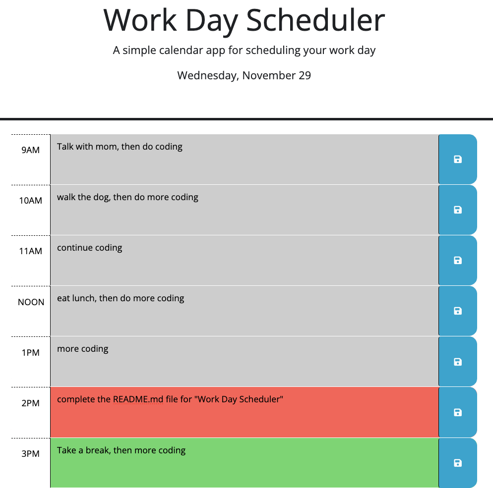

# daily-planner
A daily planner for keeping track of tasks to do during a standard 9AM - 6 PM workday
---

## Technology Used 

| Technology Used         | Resource URL           | 
| ------------- |:-------------:| 
| HTML    | [https://developer.mozilla.org/en-US/docs/Web/HTML](https://developer.mozilla.org/en-US/docs/Web/HTML) | 
| CSS     | [https://developer.mozilla.org/en-US/docs/Web/CSS](https://developer.mozilla.org/en-US/docs/Web/CSS)      |
| JavaScript     | [https://developer.mozilla.org/en-US/docs/Web/JavaScript](https://developer.mozilla.org/en-US/docs/Web/JavaScript)      |   
| Git | [https://git-scm.com/](https://git-scm.com/)     |    
| Day.js | [https://day.js.org/](https://day.js.org/)     |
| jQuery | [https://jquery.com/](https://jquery.com/)     | 
| Bootstrap | [https://getbootstrap.com/](https://getbootstrap.com/)     |  
---

## Description

[Visit the Deployed Site](https://jeffreydne.github.io/daily-planner)

This website presents a daily schedule to be filled in by the user at the start of each day. There are nine 1-hour timeblocks, each of which has a textarea allowing the user to enter tasks or appointments as needed. When the user clicks the save button to the right of the content of the textarea, that content will be stored in local stroage so that when the site is updated that task persists. The timeblocks will also be color coded with past times having a gray background, the present hour being red, and future timeblocks being green. The coloring will change with any update, if the hour has changed, using dayjs().


---

## Code Example

The below JavaScript example shows how I change the class of each timeblock dynamically using dayjs() and its format method. With these tools the actual hour is saved (using the 24 hour clock) as a number variable named hourNow. 

A series of if/else statments are then used to change the class of each timeblock based on the current time. Most of these if/else stetments are omitted, but the default case, which is shown, is for when the current time is between 1000 and 1659 inclusive. In that case 9 will be subtracted from hourNow to give the appropriate index number to get the current hour's timeblock from the array of div elements containing each timeblock. The array is stored in a jQuery variable with the name timeBlockArr.  

Using the appropriate index number to reflect the current hour's time-block, and the className method, the class is changed to include "present" which will then give it a red background using CSS. Two "for loops" are then run, which will call functions which use the same functionality. The 1st function will color all previous times gray, and the 2nd will color all future time blocks green.

```JS
  function styleHours() {
    //reset now variable (declared above) to current time using dayjs(), then use its format method to find current hour on 24 hour clock
    now = dayjs();
    let hourNow = Number(now.format('H'));
    //...
    // A series of else/if statements will check the current hour and then change the class of each time block to reflect if that timeblock is in the current hour, has already passed or is in the future. The final else below applies when the current hour is at least 10AM and no later than 4PM. The addGray and addGreen functions will add the class past and future respectively to the appropriate divs
    //...
        else {
      timeBlockArr[hourNow - 9].className = "row time-block present";
      for(let i = 0; i < hourNow - 9; i++) {
        addGray(i);
      }
      for(let i = hourNow - 8; i < 9; i++) {
        addGreen(i);
      }
    } 
  }
 
```
The below function shows how my app uses event delegation to allow a single event listener to listen for a click of all 9 textarea save buttons. I pass in the selector ".saveBtn" in the event listener at the bottom, so that when the event is triggered, the currentTarget will be stored as the button itself, even if the user clicks on the icon located within a span within the button. 

The event is then passed to the saveInput fxn and using the jQuery currentTarget() and parent() methods, the division element containing the textarea is saved in a jQuery variable named textboxParent. The jQuery attr() method is then used to determine which timeblock was clicked on, by retrieving the value of the id attribute, and storing that value in a variable "storageName". Then the value currently in that textarea is saved into local storage. The key name it is saved with is the same as the id for that timeblock.

```JS
    function saveInput(event) {
      // To find which button was pressed use event.currentTarget.parent() then store the contents of the associated text area with the name = the id attribute value using a switch statement
      let textboxParent = $(event.currentTarget).parent();

      let storageName = textboxParent.attr('id')
      
      switch (storageName) {
        case 'hour-9':
          localStorage.setItem(storageName, hour9.val());
          break;
//there is one case for each possible timeblock, only the 0900 timeblock (id="hour-9) is shown above. 

//The event listener triggering the saveInput fxn is shown below
    timeBlockArr.on('click', '.saveBtn', function (event) {
    event.preventDefault();
    styleHours();
    saveInput(event);
  });
```
## Usage

This webstie is designed to help a user keep track of their daily schedule. Each day they can type in the activities they have planned for each hour and save them into local storage by clicking the save button. Each time they refresh the page, or add more data, the color coding will refresh to reflect if each time bloc is in the past, present or future.  



---

## Learning Points

I developed this website based on a model suggested by the UC Berkeley Extension Full Stack Bootcamp. The basic HTML and CSS were provided for the 9AM to Noon portion of the scheduler. I added to the HTML and CSS to complete implementation of the site. I used JavaScript together with dayjs(), and jQuery to provide the logic for setting up a functional calendar that manipulated the DOM to insert and retrieve tasks and appointments, all while keeping in mind best practices. 

* Bootstrap is used for basic styling. 

* Each timeblock is contained within a division, with an id that relects the hour for that timeblock. This id will be used to identify to which division to insert items from local storage when the site updates. 

* Event delegation is used alllowing for a single event listener. All of the timeblock containing divisions will have a class="time-block", and an array of these elements is saved in a jQuery variable. In the event handler the .saveBtn class selector argument is used to indicate the button itself is the currentEvent of the click. 

*  When a save button is clicked on, the currentEvent is passed to a function which will use the jQuery currentEvent(), parent(),  and attr() methods to use the value of the id atribute as a localStorage key. A switch statement is then used to store the value of the textarea input for the affected time slot into localStorage with the appropriately named key.

* dayjs() is used to get the current time as soon as the application is opened, and the format method is used, along with jQuery DOM manipulation, to display the current date near the top of the page.

* dayjs() is also used in the styleHours fxn. The actual hour of the 24 hour clock is saved in a variable then a series of if/else statements allow the class of each timeslot to be dynamically changed to refect whether it represents a past, current or future hour. Using CSS the updated class will update the background color to gray for any past times, red for the present hour (if applicable) and green for any future hours.

---

## Author Info

```md
### Jeffrey Nelson


* [Portfolio](https://jeffreydne.github.io/Jeff-Nelson-Portfolio/)
* [LinkedIn](https://www.linkedin.com/in/jeffrey-nelson13/)
* [Github](https://github.com/Jeffreydne)
```

---
## Credits
 The excellent staff at UC Berkeley Extension Full Stack Bootcamp provided the beginings of the table of technology used in this README.md. The basic design and layout of the workday scheduler is provided by UC Berkeley Extension. Starter CSS and HTML is also provided to implement the 9AM to Noon appearance, without any functionality.
 To store scores using localStorage, I borrowed heavily from the web storage tutorial at freeCodeCamp.org, modifying as needed.
